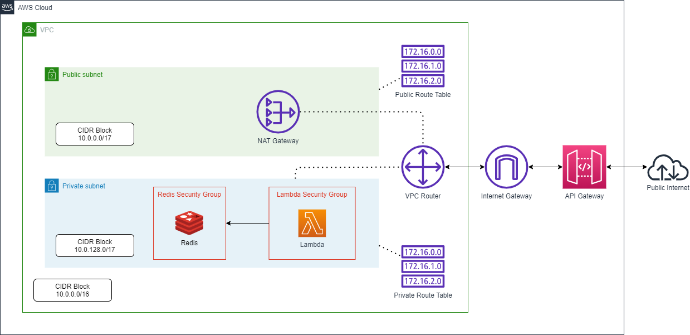

# terraform-aws-lambda-networking

🧮 Terraform template for allowing Lambda access to both private VPC resources and public internet access

This project is aimed at outlining a small AWS project in which a core Express application lives inside a Lambda function.
An API Gateway will forward requests to the Lambda, and the Lambda can either write to a backing Redis database, or make external internet API requests to Giphy for gifs.

## Inputs
- `app/.env`
  - `GIPHY_API_KEY={api_key}`
  - Used for local devlopment to pipe the Giphy API key into the Express application
- `terraform/terraform.tfvars`
  - `account_id = {account_id}`
  - `region = "{region}"`
  - `giphy_api_key = "{giphy_api_key}"`
  - Used by Terraform to authenticate with AWS and provision resources. The Giphy API key is piped into the Lambda resource to defined the environment variables.

## Output
After running a successful `terraform apply`, the process will output the endpoint URL which can be used to access the sample application.

```
api_endpoint = https://1l7isegg92.execute-api.us-west-1.amazonaws.com/active
```

## Routes
- `https://{api_endpoint}/`
  - This endpoint will print the current keys stored in Redis

- `https://{api_endpoint}/redis?key={key}&value={value}`
  - This endpoint will store `key` to `value` in Redis

- `https://{api_endpoint}/gif/{tag}`
  - This endpoint will search Giphy for a popular gif with the input tag and display it to the user

## Architecture
